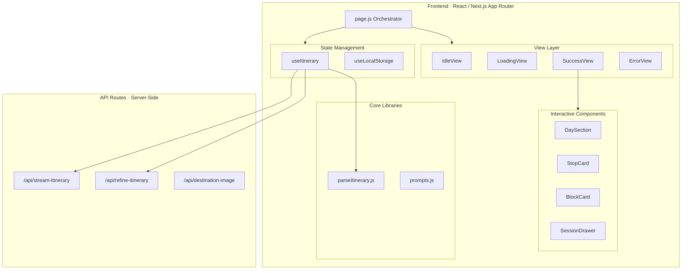

# AtlasAI — Interactive AI Trip Planner

**Author:** Shreedhar K B  
**Roll No.:** 23BCS126 | **Branch:** CSE | **Year:** 2027  
**Assignment:** Frontend Engineering Internship Assessment  
**Live Demo:** [atlas-ai-teal.vercel.app](https://atlas-ai-teal.vercel.app/)  
**Video Demo:** [Watch on Google Drive](https://drive.google.com/file/d/1oP2M6L_jw4FbMLUodHXG7X_r01Ryudnm/view?usp=sharing)


## Overview
AtlasAI turns free-form text prompts (e.g., *"3-day Goa beaches tour"*) into a fully interactive, stateful React UI. It uses the Groq API (Llama 3) to generate itineraries, but the core engineering challenge solved here is **turning unpredictable, often malformed LLM output into a reliable, typed UI.**


---

## 🤖 AI Usage Note & Attribution

The assignment states: *"Calling the model is the easy part — we're looking at how you turn unpredictable AI output into reliable UI."* Here is exactly how I built this:

### 1. What I Engineered & Designed Myself (Core Logic)
- **The 4-Layer JSON Parser & Auto-Repair (`parseItinerary.js`):** LLMs frequently truncate streaming responses or output malformed JSON. I hand-wrote a resilient parser that auto-closes strings/brackets and salvages valid data up to the truncation point so the app never crashes.
- **State Machine & Race Condition Prevention (`useItinerary.js`):** I implemented `AbortController` and request-ID tracking to immediately cancel stale network requests on rapid resubmissions.
- **System Prompt Contract & App Architecture:** I designed the strict JSON schema that bridges the non-deterministic LLM output with deterministic React components.
- **UI/UX Design:** The dark-mode aesthetic, typography (Cinzel/Plus Jakarta Sans), and responsive layout are my original design decisions.

### 2. UI Component Libraries Used
I curated specific animation primitives from open-source libraries to elevate the visual polish:
- **[react-bits](https://reactbits.dev)** & **[Magic UI](https://magicui.design)** (Used for Shimmer Buttons, Text Animations, and Spotlight Cards). The underlying animation code belongs to them; I composed them into my design.

### 3. Where I Used AI Assistance (Productivity)
I used AI (Gemini/Claude) as a productivity accelerator to implement my architectural decisions at speed:
- Scaffolding Next.js API route boilerplate and SSE streaming handlers.
- Generating repetitive Tailwind CSS utility classes and basic React component structures.
- Setting up `@dnd-kit` drag-and-drop sensor boilerplate.

*I directed the AI, made the architectural decisions, debugged the edge cases, and wrote the test suite. I own every line of code.*

---

## ⏱️ Time Spent: ~8 hours

| Phase | Hours | Focus Area |
|:---|:---:|:---|
| **UI/UX & Components** | ~3.5h | Day sections, stop cards, drag-and-drop, interactive blocks |
| **Parser & State Logic** | ~1.5h | `parseItinerary.js` auto-repair, `AbortController` implementation |
| **API & Prompting** | ~1.5h | Streaming endpoint, refinement loop, system prompt design |
| **Polish & Sessions** | ~1.5h | LocalStorage caching, JSON export/import, Tests, Image API |

---

## Quick Start

```bash
git clone https://github.com/shreedharkb/AtlasAI.git
cd trip-planner
npm install
```

Create `.env.local` in the project root:
```env
GROQ_API_KEY=your_groq_api_key_here
```
> Get a free key at [console.groq.com](https://console.groq.com). Keys are used **server-side only** — never exposed to the browser.

```bash
npm run dev       # Development server at http://localhost:3000
npm test          # Run parser test suite (13 tests)
npm run build     # Production build
```

---

## System Architecture

> *Diagram renders on GitHub.*


