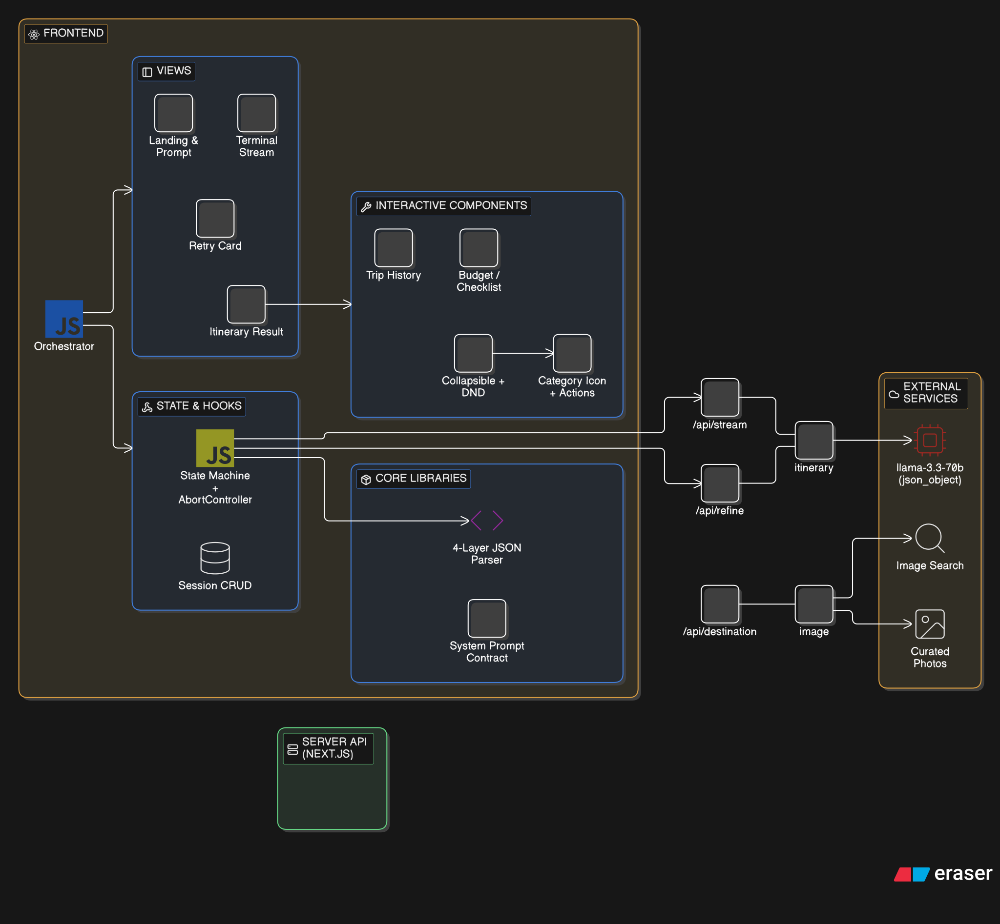

# AtlasAI — Interactive AI Trip Planner

**Author:** Shreedhar K B  
**Roll No.:** 23BCS126  
**Branch:** CSE  
**Year:** 2027  
**Assignment:** Frontend Engineering Internship Assessment  
**Live Demo:** [atlas-ai-teal.vercel.app](https://atlas-ai-teal.vercel.app/)  
**Video Demo:** [Watch on Google Drive](https://drive.google.com/file/d/1oP2M6L_jw4FbMLUodHXG7X_r01Ryudnm/view?usp=sharing)

---

## What This Is

AtlasAI takes a free-form text prompt like *"5-day food tour in Tokyo on a budget"* and turns it into a fully interactive, structured trip planner — not a chatbot. The AI output is parsed into typed JSON and rendered as draggable day cards, live budget charts, checkable packing lists, and refineable itinerary blocks.

**The hard problem this solves:** LLMs produce unpredictable output. They truncate mid-stream, wrap JSON in markdown, invent field names, and return malformed structures. This app is built around making that unreliable output work reliably in a real UI.

---

## Quick Start

```bash
git clone https://github.com/shreedharkb/AtlasAI.git
cd trip-planner
npm install
```

Create `.env.local` in the project root:
```env
GROQ_API_KEY=your_groq_api_key_here
```
> Get a free key at [console.groq.com](https://console.groq.com). Keys are used **server-side only** — never exposed to the browser.

```bash
npm run dev       # Development server at http://localhost:3000
npm test          # Run parser test suite (13 tests)
npm run build     # Production build
```

---

## Feature Coverage

| Requirement | How It's Implemented |
|:---|:---|
| **Structured output from free-form input** | Server-side API routes convert prompts to strict JSON schemas (`days[]`, `blocks[]`) via Groq's `response_format: json_object` mode |
| **Interactive UI from AI data** | Every data point → functional component: drag-and-drop stops (`@dnd-kit`), expandable day cards, removable items, checkable lists |
| **Handling bad AI output** | Multi-layer JSON parser with truncated-output auto-repair, markdown extraction, fuzzy field matching, and category inference |
| **Streaming** | Real-time SSE streaming with live terminal UI, progress bar, and character-by-character preview |
| **Refinement loop** | Follow-up edits without losing state — current itinerary is sent as context to the refinement endpoint |
| **Session persistence** | `localStorage` archiving with sliding drawer UI, plus JSON export/import for backup |
| **Stale response prevention** | Request-ID tracking + `AbortController` cancels in-flight requests on rapid resubmission |
| **Accessibility** | Keyboard navigation (`Ctrl+Enter`, `Escape`), `prefers-reduced-motion` support, ARIA labels on all interactive elements |

---

## System Architecture



### Folder Structure

```
app/
├── page.js                        Orchestrator — state + view routing
├── api/
│   ├── stream-itinerary/route.js  SSE streaming endpoint (Groq)
│   ├── refine-itinerary/route.js  Refinement endpoint (context-aware)
│   └── destination-image/route.js Image resolver (atlas → Wikipedia → Unsplash)
├── globals.css                    Design tokens, fonts, reduced-motion rules

components/
├── views/
│   ├── idle-view.jsx              Landing page with prompt input
│   ├── loading-view.jsx           Streaming progress + terminal
│   ├── success-view.jsx           Itinerary result (days, blocks, refine)
│   ├── error-view.jsx             Glassmorphic error card with retry
│   └── stop-detail-modal.jsx      Full stop info modal
├── day-section.jsx                Collapsible day with drag-and-drop stops
├── stop-card.jsx                  Individual stop with category icon + actions
├── block-card.jsx                 Budget chart / checklist / tips renderer
├── session-drawer.jsx             Previous trips sidebar

hooks/
├── useItinerary.js                State machine (idle → loading → streaming → success | error)
├── useLocalStorage.js             Session CRUD operations

lib/
├── parseItinerary.js              Multi-layer JSON parser + auto-repair
├── prompts.js                     Centralized LLM system prompts
├── iconResolver.js                Curated icon lookup map
├── constants.js                   Categories, error messages, example prompts
├── idGenerator.js                 Collision-free ID generator
└── __tests__/
    └── parseItinerary.test.js     13 test cases for parser resilience
```

---

## Engineering Deep Dive: Handling Bad AI Output

This is the core technical challenge of the assignment. Here's how `parseItinerary.js` handles it:

### The Problem

LLMs don't reliably produce valid JSON. In production, I encountered:
- Output wrapped in ` ```json ``` ` markdown blocks
- Trailing commas after the last array element
- Streaming cutoffs mid-token (truncated JSON)
- `snake_case` field names instead of `camelCase`
- Invented categories like `"gastronomy"` instead of `"food"`
- Unescaped newlines inside JSON string values

### The Solution: 4-Layer Extraction Pipeline

```
Raw AI text
  │
  ├─→ Layer 1: Direct JSON.parse()              → works ~70% of the time
  │
  ├─→ Layer 2: Markdown code block extraction    → handles ```json wrapping
  │
  ├─→ Layer 3: Bracket-matching extraction       → finds { } in surrounding text
  │
  └─→ Layer 4: Truncated JSON auto-repair        → iterative prefix salvage
        │
        ├─ Close open strings
        ├─ Strip dangling commas / colons
        └─ Close open brackets in reverse order
            (up to 150 backtrack attempts)
```

After extraction, a **normalization layer** handles:
- Fuzzy field matching (`trip_title` → `tripTitle`, `activities` → `stops`)
- Category inference from keywords (`"sushi restaurant"` → `food`)
- String-to-object stop conversion
- Parent key unwrapping (`{ itinerary: { ... } }` → `{ ... }`)

### Concrete Failure → Recovery Example

**Input (truncated streaming response):**
```json
{"tripTitle":"Tokyo Food Tour","days":[{"dayNumber":1,"title":"Tsukiji & Ginza","stops":[{"id":"stop-1-1","name":"Tsukiji Outer Market","time":"8:00 AM","duration":"2 hours","description":"Fresh seafood breakf
```

**What happens:** The parser detects the truncation, closes the open string (`"breakf"`→`"breakf"`), strips the dangling property, closes the open object and arrays (`}]}]}`), and successfully renders Day 1 with the one complete stop. The user sees their partial itinerary immediately instead of a cryptic error.

### Test Coverage

All of this is validated by 13 automated test cases (`npm test`):

```
✓ parses valid JSON correctly
✓ returns error for empty input
✓ extracts JSON from markdown code blocks
✓ finds JSON object embedded in surrounding text
✓ repairs truncated JSON by closing open brackets
✓ handles trailing commas in arrays and objects
✓ normalizes alternative field names (snake_case, synonyms)
✓ handles stops that are plain strings instead of objects
✓ fuzzy-matches unknown categories from stop names
✓ returns error when no days are present
✓ handles unescaped newlines and tabs inside JSON string values
✓ unwraps itinerary from parent wrapper keys
✓ normalizes budget, checklist, and tips blocks
```

---

## Race Condition Prevention

Rapid submissions or back-button clicks during streaming create a classic stale-closure problem. The `useItinerary` hook solves this with:

1. **Request ID tracking** — each `generateItinerary()` call generates a unique ID stored in `currentRequestId.current`
2. **Pre-flight check** — before updating state with a response, the hook verifies the response's ID matches the current ID
3. **AbortController** — older in-flight `fetch()` calls are aborted immediately when a new request starts
4. **45-second timeout** — catches hanging responses and routes to the error UI

---

## AI Usage & Attribution

### My design & architecture decisions
- **UI design and visual identity** — I chose the dark-mode aesthetic, the typography stack (Cinzel, Cormorant Garamond, Plus Jakarta Sans), the color palette, and the overall layout composition. The look and feel of this app is my creative work.
- **Architecture decisions** — I designed the state machine flow (`idle → loading → streaming → success | error`), the JSON schema contract between AI output and React components, the 4-layer parser strategy, and the component decomposition into views/hooks/lib.
- **Feature scoping** — I decided which stretch goals to pursue (streaming, refinement loop, session persistence, drag-and-drop) and how they should work together.

### UI component libraries I used
I selected and composed animation components from open-source libraries to enhance the visual experience:
- **[react-bits](https://reactbits.dev):** `ShinyText`, `DecryptedText`, `SpotlightCard`, `PixelCard`, `MetallicPaint`, `Magnet`, `TiltedCard`, `BorderGlow`
- **[Magic UI](https://magicui.design):** `ShimmerButton`, `HyperText`, `Terminal`, `AnimatedCircularProgressBar`, `BorderBeam`, `PixelImage`

I chose, configured, and composed these into the overall UI — the underlying animation code is from these libraries.

### Where I used AI assistance
I used AI coding assistants (Gemini, Claude) extensively for implementation:
- **Core logic** — the `parseItinerary.js` parser, `useItinerary.js` state machine, API route handlers, and streaming implementation were built with AI assistance
- **Component code** — React component structure, Tailwind styling, `@dnd-kit` drag-and-drop configuration, Framer Motion animations
- **Backend** — Next.js API routes, Groq integration, SSE stream handling


---

## Known Limitations

- **Very long itineraries** (30+ days) may exceed the model's output token limit. The parser auto-repairs and renders all complete days up to the truncation point.
- **Model fallback** — if Groq rate-limits the 70B model, the app automatically retries with `llama-3.1-8b-instant` (faster but slightly lower quality).

---

## What I'd Do Next

If I had more time beyond the ~7-hour budget:

1. **Map integration** — Render stops on an interactive map (Mapbox/Leaflet) with route visualization between stops
2. **Cost estimation API** — Pull real pricing data from travel APIs (Skyscanner, Booking.com) to ground the budget block in reality
3. **Offline support** — Service worker + IndexedDB for full offline capability after first load
4. **Component-level error boundaries** — React error boundaries around each `DaySection` so a single malformed day doesn't crash the entire itinerary view
5. **E2E tests** — Playwright tests that mock the Groq API and verify the full user flow from prompt → streaming → rendered itinerary
6. **Collaborative editing** — WebSocket-based real-time sync so multiple users can plan a trip together

---

## Time Spent

**Total: ~8 hours**

| Phase | Hours | What |
|:---|:---:|:---|
| UI/UX & Components | ~3.5h | Day sections, stop cards, budget charts, modals, drag-and-drop |
| Parser & Error Handling | ~1.5h | `parseItinerary.js` auto-repair, `useItinerary` state machine |
| API Routes & Prompting | ~1.5h | Streaming endpoint, refinement loop, system prompt design |
| Polish & Sessions | ~1.5h | localStorage archiving, JSON export/import, keyboard nav, tests |
